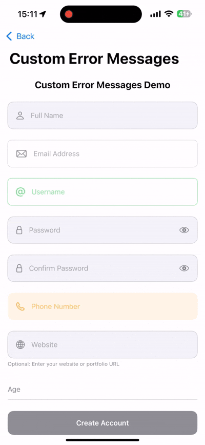

# FloatingTextFieldSwiftUI

A highly customizable and feature-rich floating label text field component for SwiftUI, inspired by Material Design principles.



## ✨ Features

- 🎨 **Multiple Built-in Styles**: Default, Material, Outlined, Filled, Minimal, and Custom styles
- ✅ **Comprehensive Validation**: Built-in validators for email, phone, URL, password, and more
- 🔄 **Real-time Validation**: Validate as users type with customizable error messages
- 🔒 **Secure Text Entry**: Built-in password field support with show/hide toggle
- 🎯 **Focus Management**: Smooth animations and focus state handling
- 🔧 **Highly Customizable**: Extensive modifier API for complete customization
- 📱 **Keyboard Support**: Different keyboard types and input methods
- 🖼️ **Icon Support**: Leading and trailing icons with SF Symbols
- 💡 **Helper Text**: Optional helper text and validation error messages
- 🎭 **Custom Content**: Support for custom leading and trailing content

## 📋 Requirements

- iOS 15.0+
- Xcode 16.0+
- Swift 5.5+

## 📦 Installation

### Swift Package Manager

Add the following to your `Package.swift` file:

```swift
dependencies: [
    .package(url: "https://github.com/mohammadnabulsi/FloatingTextFieldSwiftUI.git", from: "1.0.0")
]
```

Or add it through Xcode:
1. Go to `File` → `Add Package Dependencies`
2. Enter the repository URL
3. Click `Add Package`

## 🚀 Quick Start

### Basic Usage

```swift
import SwiftUI
import FloatingTextFieldSwiftUI

struct ContentView: View {
    @State private var email = ""
    @State private var name = ""
    
    var body: some View {
        VStack(spacing: 20) {
            FloatingTextField($name, label: "Full Name")
                .leadingIcon("person")
            
            FloatingTextField($email, label: "Email Address")
                .leadingIcon("envelope")
                .keyboardType(.emailAddress)
                .email()
                .required()
        }
        .padding()
    }
}
```

### Password Field with Validation

```swift
struct PasswordView: View {
    @State private var password = ""
    @State private var isPasswordVisible = false
    
    var body: some View {
        FloatingTextField($password, label: "Password")
            .leadingIcon("lock")
            .secure(!isPasswordVisible)
            .password(minLength: 8, requireNumbers: true, requireSpecialChars: true)
            .trailingContent {
                Button(action: { isPasswordVisible.toggle() }) {
                    Image(systemName: isPasswordVisible ? "eye.slash" : "eye")
                        .foregroundColor(.secondary)
                }
            }
            .padding()
    }
}
```

## 🎨 Styles

### Available Styles

```swift
// Default Style
FloatingTextField($text, label: "Default")

// Material Design Style
FloatingTextField($text, label: "Material")
    .floatingTextFieldStyle(MaterialFloatingStyle())

// Outlined Style
FloatingTextField($text, label: "Outlined")
    .floatingTextFieldStyle(OutlinedFloatingStyle())

// Filled Style
FloatingTextField($text, label: "Filled")
    .floatingTextFieldStyle(FilledFloatingStyle())

// Minimal Style
FloatingTextField($text, label: "Minimal")
    .floatingTextFieldStyle(MinimalFloatingStyle())

// Custom Style
FloatingTextField($text, label: "Custom")
    .floatingTextFieldStyle(CustomFloatingStyle(
        accent: .purple,
        background: .purple.opacity(0.1),
        border: .purple.opacity(0.3)
    ))
```

## ✅ Validation

### Built-in Validators

```swift
struct ValidationExample: View {
    @State private var email = ""
    @State private var phone = ""
    @State private var username = ""
    @State private var age = ""
    
    var body: some View {
        VStack(spacing: 16) {
            // Email validation
            FloatingTextField($email, label: "Email")
                .leadingIcon("envelope")
                .email("Please enter a valid email address")
                .required("Email is required")
                .validateRealTime()
            
            // Phone number validation
            FloatingTextField($phone, label: "Phone Number")
                .leadingIcon("phone")
                .phoneNumber("Please enter a valid phone number")
                .keyboardType(.phonePad)
            
            // Username validation
            FloatingTextField($username, label: "Username")
                .leadingIcon("at")
                .alphanumeric("Only letters and numbers allowed")
                .minLength(3, errorMessage: "Username must be at least 3 characters")
                .maxLength(20, errorMessage: "Username cannot exceed 20 characters")
            
            // Age validation
            FloatingTextField($age, label: "Age")
                .leadingIcon("calendar")
                .numeric("Please enter a valid number")
                .keyboardType(.numberPad)
        }
        .padding()
    }
}
```

### Custom Validation

```swift
FloatingTextField($text, label: "Custom Validation")
    .validation([
        ValidationRule(
            condition: { !$0.isEmpty },
            errorMessage: "This field cannot be empty"
        ),
        ValidationRule(
            condition: { $0.count >= 5 },
            errorMessage: "Must be at least 5 characters"
        ),
        ValidationRule(
            condition: { $0.contains("@") },
            errorMessage: "Must contain @ symbol"
        )
    ])
    .validateRealTime(true)
    .onValidationChange { isValid in
        print("Field is valid: \(isValid)")
    }
```

## 🔧 Advanced Configuration

### Complete Form Example

```swift
struct RegistrationForm: View {
    @State private var fullName = ""
    @State private var email = ""
    @State private var password = ""
    @State private var confirmPassword = ""
    @State private var website = ""
    @State private var isPasswordVisible = false
    @State private var isFormValid = false
    
    var body: some View {
        ScrollView {
            VStack(spacing: 20) {
                Text("Create Account")
                    .font(.title2)
                    .fontWeight(.bold)
                
                FloatingTextField($fullName, label: "Full Name")
                    .leadingIcon("person")
                    .required("Please enter your full name")
                    .alphabetic("Name should only contain letters")
                    .minLength(2)
                    .floatingTextFieldStyle(MaterialFloatingStyle())
                    .onValidationChange { isValid in
                        updateFormValidation()
                    }
                
                FloatingTextField($email, label: "Email Address")
                    .leadingIcon("envelope")
                    .keyboardType(.emailAddress)
                    .required("Email address is required")
                    .email("Please enter a valid email format")
                    .floatingTextFieldStyle(OutlinedFloatingStyle())
                    .onValidationChange { isValid in
                        updateFormValidation()
                    }
                
                FloatingTextField($password, label: "Password")
                    .leadingIcon("lock")
                    .secure(!isPasswordVisible)
                    .password(
                        minLength: 8,
                        requireNumbers: true,
                        requireSpecialChars: true,
                        errorMessage: "Password must be 8+ characters with numbers and special characters"
                    )
                    .trailingContent {
                        Button(action: { isPasswordVisible.toggle() }) {
                            Image(systemName: isPasswordVisible ? "eye.slash" : "eye")
                                .foregroundColor(.secondary)
                        }
                    }
                    .floatingTextFieldStyle(FilledFloatingStyle())
                    .onValidationChange { isValid in
                        updateFormValidation()
                    }
                
                FloatingTextField($confirmPassword, label: "Confirm Password")
                    .leadingIcon("lock")
                    .secure(true)
                    .validation([
                        ValidationRule(
                            condition: { !$0.isEmpty },
                            errorMessage: "Please confirm your password"
                        ),
                        ValidationRule(
                            condition: { $0 == password },
                            errorMessage: "Passwords don't match"
                        )
                    ])
                    .onValidationChange { isValid in
                        updateFormValidation()
                    }
                
                FloatingTextField($website, label: "Website")
                    .leadingIcon("globe")
                    .keyboardType(.URL)
                    .url("Please enter a valid URL")
                    .helperText("Optional: Enter your website URL")
                    .floatingTextFieldStyle(MinimalFloatingStyle())
                
                Button(action: submitForm) {
                    Text("Create Account")
                        .fontWeight(.semibold)
                        .frame(maxWidth: .infinity)
                        .padding()
                        .background(isFormValid ? Color.blue : Color.gray)
                        .foregroundColor(.white)
                        .cornerRadius(12)
                }
                .disabled(!isFormValid)
            }
            .padding()
        }
    }
    
    private func updateFormValidation() {
        // Custom form validation logic
        isFormValid = !fullName.isEmpty && !email.isEmpty && !password.isEmpty && !confirmPassword.isEmpty
    }
    
    private func submitForm() {
        print("Form submitted successfully!")
    }
}
```

## 📖 API Reference

### Modifiers

| Modifier | Description | Example |
|----------|-------------|---------|
| `.floatingTextFieldStyle(_:)` | Apply a custom style | `.floatingTextFieldStyle(MaterialFloatingStyle())` |
| `.secure(_:)` | Enable/disable secure text entry | `.secure(true)` |
| `.keyboardType(_:)` | Set keyboard type | `.keyboardType(.emailAddress)` |
| `.leadingIcon(_:)` | Add leading icon | `.leadingIcon("envelope")` |
| `.trailingContent(_:)` | Add custom trailing content | `.trailingContent { Button(...) }` |
| `.leadingContent(_:)` | Add custom leading content | `.leadingContent { Image(...) }` |
| `.helperText(_:)` | Set helper text | `.helperText("Optional field")` |
| `.enabled(_:)` | Enable/disable field | `.enabled(false)` |
| `.validateRealTime(_:)` | Enable real-time validation | `.validateRealTime(true)` |
| `.onValidationChange(_:)` | Validation state callback | `.onValidationChange { isValid in ... }` |

### Validation Modifiers

| Modifier | Description | Example |
|----------|-------------|---------|
| `.required(_:)` | Make field required | `.required("This field is required")` |
| `.email(_:)` | Email validation | `.email("Invalid email format")` |
| `.phoneNumber(_:)` | Phone number validation | `.phoneNumber("Invalid phone number")` |
| `.url(_:)` | URL validation | `.url("Invalid URL")` |
| `.minLength(_:errorMessage:)` | Minimum length | `.minLength(8, errorMessage: "Too short")` |
| `.maxLength(_:errorMessage:)` | Maximum length | `.maxLength(50, errorMessage: "Too long")` |
| `.alphanumeric(_:)` | Alphanumeric only | `.alphanumeric("Letters and numbers only")` |
| `.alphabetic(_:)` | Alphabetic only | `.alphabetic("Letters only")` |
| `.numeric(_:)` | Numeric only | `.numeric("Numbers only")` |
| `.password(...)` | Password validation | `.password(minLength: 8, requireNumbers: true)` |
| `.validation(_:)` | Custom validation rules | `.validation([ValidationRule(...)])` |

## 📄 License

This project is licensed under the MIT License - see the [LICENSE](LICENSE) file for details.

## 👏 Acknowledgments

- Inspired by Material Design floating label text fields
- Built with ❤️ for the SwiftUI community

## 📞 Support

If you have any questions or need help, please open an issue on GitHub.

---

⭐ **Star this repo if you found it helpful!** ⭐
